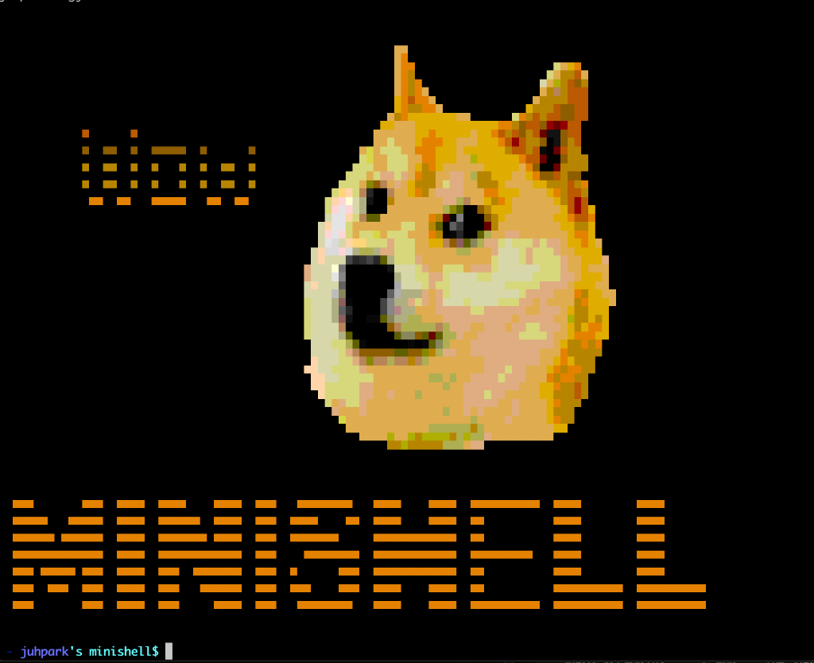

# 🐚 Minishell



> **42 Seoul** 의 공통 교육과정 프로젝트로, C언어를 사용하여 POSIX 호환 기능 및 자체적인 CLI 환경을 갖춘 미니 쉘을 구현했습니다.  
> 본 프로젝트는 외부 입력 라이브러리(`readline`)를 사용하지 않고, **Ncurses/Termcap**과 터미널 제어 설정을 활용해 커서 이동, 명령어 기록(History), 라인 편집 등의 터미널 사용자 환경(CLI)을 바닥부터 구현한 것이 가장 큰 특징입니다.

---

## 🛠️ 기술 스택 및 개발 환경
- **Language:** C (C99 표준 준수)
- **Library:** `Ncurses` (Termcap 기능을 포함한 터미널 데이터베이스 라이브러리)
- **OS:** macOS (POSIX 환경)
- **Compiler:** `gcc` (with `-Wall -Wextra -Werror` flags)

---

## ✨ 핵심 구현 특징

### 1. ⌨️ Ncurses/Termcap 기반 독자적 CLI 인터페이스
보통 `readline` 라이브러리를 통해 제공받는 명령줄 인터페이스(CLI) 제어 기능을 직접 구현하였습니다.
- **비캐노니컬 모드(Non-Canonical Mode) 전환**: `termios` 구조체를 조작하여 엔터 입력 전에도 사용자의 키 입력을 실시간으로 1바이트씩 감지하고 화면 에코(`ECHO`)를 비활성화합니다.
- **화면 렌더링 및 커서 제어**: `tputs`와 termcap 명령어(`cm`, `ce`, `dc` 등)를 사용하여 화면의 커서 좌표를 제어하고, 문자 삽입 및 삭제(Backspace) 시 텍스트를 실시간으로 다시 렌더링합니다.
- **명령어 히스토리(History) 관리**: 이중 연결 리스트 구조로 입력한 명령어를 저장하고, 키보드 방향키(위/아래) 입력 시 이전/다음 명령어로 프롬프트를 교체해줍니다.

### 2. 🔍 명령어 구문 분석 (Lexer & Parser)
- **토큰 분리**: 입력받은 명령어 라인을 세미콜론 `;`, 파이프 `|`, 리다이렉션 문자 `<`, `>`, `>>`를 기준으로 토큰화하여 트리 혹은 연결 리스트 형태의 데이터 구조(`t_par`)로 변환합니다.
- **따옴표(Quotes) 처리**: 작은따옴표 `'`와 큰따옴표 `"`의 닫힘 및 이스케이프 상태를 추적하여 하나의 토큰 내 문자열을 올바르게 결합합니다.
- **환경변수 확장 (Dollar Expansion)**: 문자열 내의 `$ENV` 패턴을 감지하여 쉘 메모리 내부의 환경변수 테이블에서 실제 값을 찾아 치환합니다.

### 3. 🔄 파이프(Pipe) & 리다이렉션(Redirection)
- **파이프 (`|`)**: 명령어 리스트를 순회하며 파이프를 감지할 때마다 `pipe()`를 생성하고, 자식 프로세스를 `fork()`한 뒤 `dup2()`를 통해 표준 입력/출력을 파이프 파일 디스크립터로 교체하여 다중 파이프 명령을 처리합니다.
- **리다이렉션**:
  - `<` : 표준 입력을 특정 파일로 리다이렉트 (`O_RDONLY`).
  - `>` : 표준 출력을 파일에 덮어쓰기 형태로 리다이렉트 (`O_WRONLY | O_TRUNC | O_CREAT`).
  - `>>` : 표준 출력을 파일 뒤에 추가하는 형태로 리다이렉트 (`O_WRONLY | O_APPEND | O_CREAT`).

### 4. 🎛️ 쉘 내장 명령어 (Built-in Commands)
프로세스 실행 대신 쉘 내부에서 바로 처리되어야 하는 핵심 명령어 7가지를 자체 구현하였습니다.
- `echo` (옵션 `-n` 지원)
- `cd` (상대 경로 및 절대 경로 디렉토리 이동)
- `pwd` (현재 작업 디렉토리 절대 경로 출력)
- `export` (새로운 환경 변수 선언 및 출력)
- `unset` (기존 환경 변수 제거)
- `env` (전체 환경 변수 목록 출력)
- `exit` (쉘 종료 및 종료 상태 코드 반환)

---

## 📂 프로젝트 디렉토리 구조

```text
.
├── Makefile             # 빌드 및 실행을 위한 메이크파일
├── minishell.c          # 쉘의 메인 루프 및 터미널 입력 직접 처리부
├── minishell.h          # 쉘의 전역 자료구조 및 함수 원형 선언 헤더
└── srcs                 # 핵심 기능 소스 폴더
    ├── init.c           # 터미널 속성(termios) 초기화 및 시그널 설정
    ├── signal.c         # Ctrl-C, Ctrl-D, Ctrl-\ 시그널 가로채기 및 핸들링
    ├── prompt.c         # 프롬프트 출력 및 아스키 아트 로드
    ├── cursor.c         # 화면 내 커서 이동 및 렌더링 좌표 제어
    ├── key.c            # 방향키 및 백스페이스 등 키 입력 개별 처리
    ├── history.c        # 명령어 히스토리 리스트 관리
    ├── exe.c / util_exe.c # 명령어 실행(fork, execve) 및 파이프 배관 처리
    ├── parse.c          # 문자열 구문 분석 및 토큰 연결 리스트 생성
    ├── redir.c          # 리다이렉션 fd 백업 및 파일 디스크립터 교체
    ├── builtin.c        # 빌트인 명령어 조건 분기
    ├── cd.c / pwd.c / exit.c / echo.c / env.c / export.c / unset.c # 빌트인 명령어 개별 소스
    ├── err.c            # 상황별 에러 메시지 출력 및 상태 코드(exit code) 갱신
    └── util1.c ~ util6.c # libft 함수들을 대체하는 자체 유틸리티 라이브러리
```

---

## 🚀 빌드 및 실행 방법

### 요구사항
- macOS 환경 (Ncurses 라이브러리가 기본적으로 설치되어 있습니다.)

### 컴파일
프로젝트 루트 디렉토리에서 다음 명령어를 실행하여 빌드합니다.
```bash
make
```

### 실행
빌드된 바이너리를 실행하거나, `make run`을 사용하여 바로 시작할 수 있습니다.
```bash
make run
```

### 빌드 파일 청소
오브젝트 파일(`.o`) 또는 바이너리를 삭제하고 싶을 때는 아래 명령어를 사용합니다.
```bash
# 오브젝트 파일 삭제
make clean

# 오브젝트 파일 및 minishell 실행 파일 전체 삭제
make fclean

# 재빌드
make re
```

---

## 👥 개발자 및 기여
- [kwanhokim]((https://github.com/KKWANH))
- [juhopark](https://github.com/juhpark)
